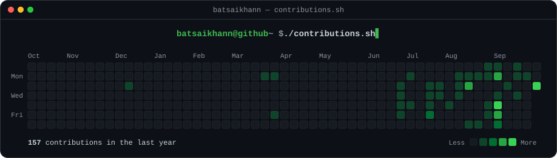
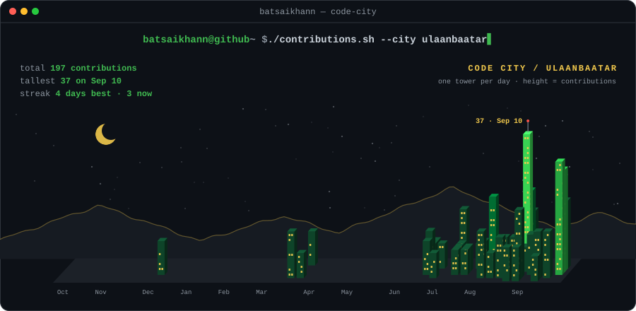
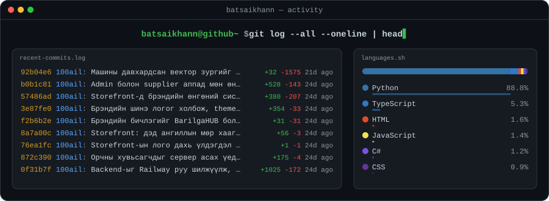
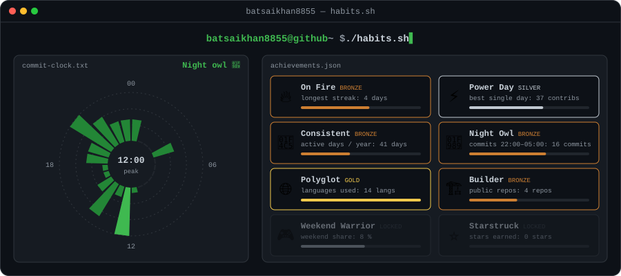
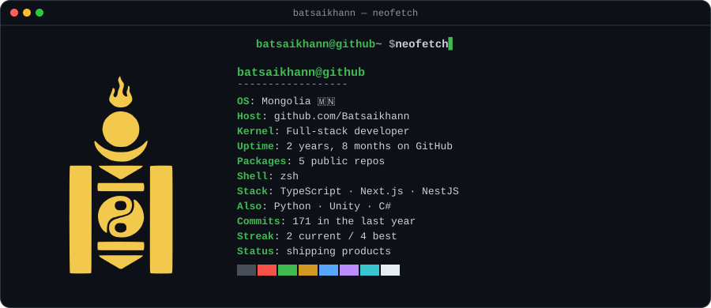
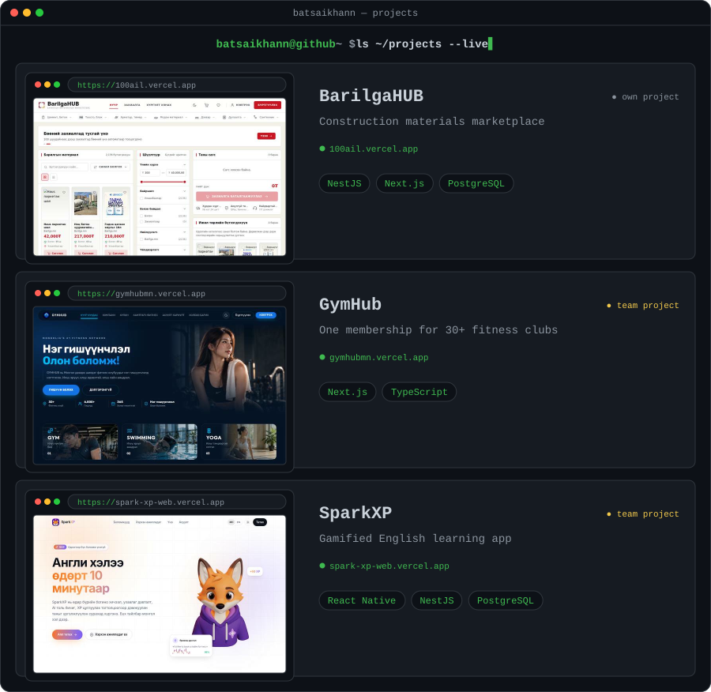
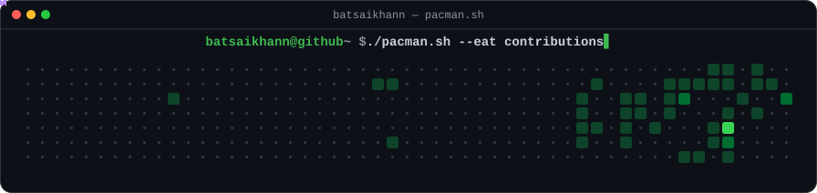

<div align="center">

<picture><source media="(prefers-color-scheme: light)" srcset="assets/light/header.svg"></picture>

<a href="https://github.com/Batsaikhann?tab=repositories"></a>
<a href="https://github.com/Batsaikhann?tab=followers"></a>

<br/><br/>

<picture><source media="(prefers-color-scheme: light)" srcset="assets/light/contributions.svg"></picture>

<picture><source media="(prefers-color-scheme: light)" srcset="assets/light/city.svg"></picture>

<picture><source media="(prefers-color-scheme: light)" srcset="assets/light/whoami.svg"></picture>

<picture><source media="(prefers-color-scheme: light)" srcset="assets/light/activity.svg"></picture>

<picture><source media="(prefers-color-scheme: light)" srcset="assets/light/habits.svg"></picture>

<picture><source media="(prefers-color-scheme: light)" srcset="assets/light/neofetch.svg"></picture>

<picture><source media="(prefers-color-scheme: light)" srcset="assets/light/ub.svg"></picture>

<br/>

<picture><source media="(prefers-color-scheme: light)" srcset="assets/light/projects.svg"></picture>

<a href="https://100ail.vercel.app"><b>100ail</b></a> · <a href="https://github.com/Batsaikhann/100ail">code</a>
&nbsp;│&nbsp;
<a href="https://sporthub-eight.vercel.app"><b>SportHub</b></a>
&nbsp;│&nbsp;
<a href="https://gymhubmn.vercel.app"><b>GymHub</b></a> <sub>team</sub>
&nbsp;│&nbsp;
<a href="https://spark-xp-web.vercel.app"><b>SparkXP</b></a> · <a href="https://github.com/usukh6ayar/SparkXP">code</a> <sub>team</sub>
<br/>
<a href="https://github.com/Batsaikhann/bikemap_ub"><b>bikemap_ub</b></a> <sub>bike map for Ulaanbaatar · Python</sub>
&nbsp;│&nbsp;
<a href="https://github.com/Batsaikhann/Unity-Endless-Game"><b>Unity-Endless-Game</b></a> <sub>endless runner · Unity · C#</sub>

<br/><br/>

```console
batsaikhann@github ~ $ ./stack.sh
```

<picture><source media="(prefers-color-scheme: light)" srcset="https://skillicons.dev/icons?i=ts,nextjs,react,nestjs,nodejs,python,postgres,supabase,vercel,unity,cs,git&theme=light"></picture>

<br/><br/>

```console
batsaikhann@github ~ $ ./snake.sh --eat contributions
```

<picture><source media="(prefers-color-scheme: light)" srcset="https://raw.githubusercontent.com/Batsaikhann/Batsaikhann/output/snake-light.svg"></picture>

<picture><source media="(prefers-color-scheme: light)" srcset="assets/light/pacman.svg"></picture>

<sub>every card on this page regenerates hourly via GitHub Actions · <code>scripts/generate.py</code></sub>

</div>
