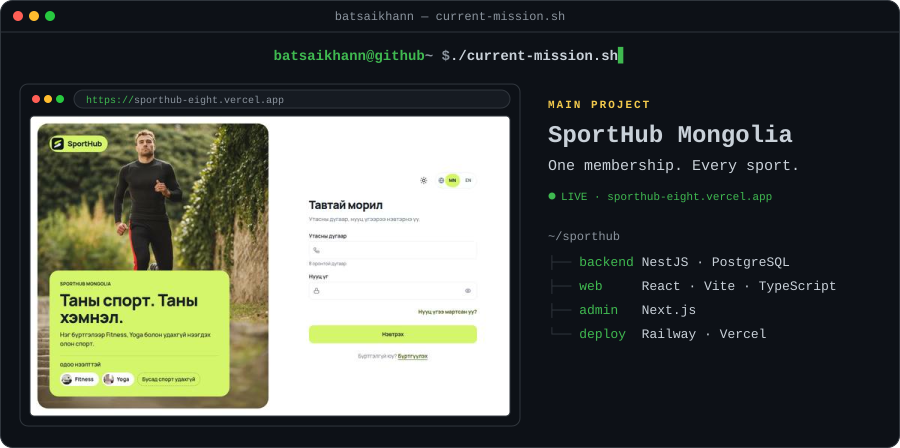
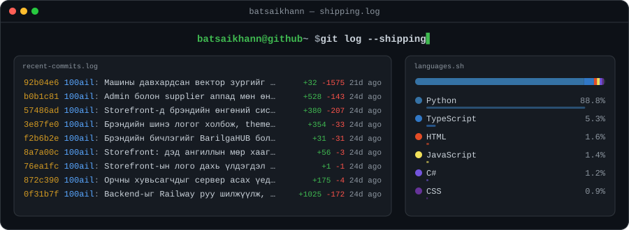
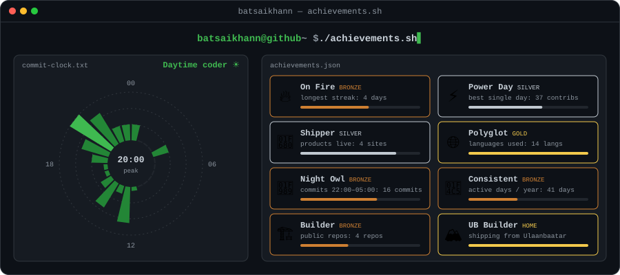
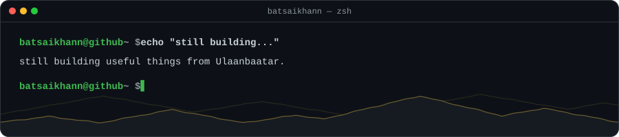

<!-- BATSAIKHANN OS — every card in assets/ is regenerated hourly by .github/workflows/update.yml (scripts/generate.py) -->

<div align="center">

<!-- HERO -->

#### `/boot`

<picture><source media="(prefers-color-scheme: light)" srcset="assets/light/hero.svg"></picture>

<sub><a href="#boot"><code>/boot</code></a> · <a href="#whoami"><code>/whoami</code></a> · <a href="#current-mission"><code>/current-mission</code></a> · <a href="#activity"><code>/activity</code></a> · <a href="#stack"><code>/stack</code></a> · <a href="#achievements"><code>/achievements</code></a> · <a href="#projects"><code>/projects</code></a> · <a href="#network"><code>/network</code></a></sub>

<!-- WHOAMI -->

#### `/whoami`

<picture><source media="(prefers-color-scheme: light)" srcset="assets/light/whoami.svg"></picture>

<picture><source media="(prefers-color-scheme: light)" srcset="assets/light/neofetch.svg"></picture>

<!-- PROJECTS: current mission -->

#### `/current-mission`

<picture><source media="(prefers-color-scheme: light)" srcset="assets/light/mission.svg"></picture>

<a href="https://sporthub-eight.vercel.app"><b>▶ Live demo</b></a> &nbsp;·&nbsp; <sub>source is private</sub>

<!-- ACTIVITY -->

#### `/activity`

<picture><source media="(prefers-color-scheme: light)" srcset="assets/light/city.svg"></picture>

<picture><source media="(prefers-color-scheme: light)" srcset="assets/light/shipping.svg"></picture>

<!-- STACK -->

#### `/stack`

</div>

```console
batsaikhann@github ~ $ tree ~/stack
~/stack
├── frontend
│   ├── Next.js · React
│   └── TypeScript · Tailwind CSS
├── backend
│   └── NestJS · Node.js
├── database
│   └── PostgreSQL · Supabase
├── deploy
│   └── Vercel · Railway
└── other
    └── Python · Unity · C#
```

<div align="center">

<picture><source media="(prefers-color-scheme: light)" srcset="https://skillicons.dev/icons?i=ts,nextjs,react,tailwind,nestjs,nodejs,postgres,supabase,vercel,python,unity,cs&perline=12&theme=light"></picture>

<!-- ACHIEVEMENTS -->

#### `/achievements`

<picture><source media="(prefers-color-scheme: light)" srcset="assets/light/achievements.svg"></picture>

<!-- PROJECTS: live showcase -->

#### `/projects`

<picture><source media="(prefers-color-scheme: light)" srcset="assets/light/projects.svg"></picture>

<a href="https://100ail.vercel.app"><b>BarilgaHUB</b></a> · <a href="https://github.com/Batsaikhann/100ail">source</a>
&nbsp;│&nbsp;
<a href="https://gymhubmn.vercel.app"><b>GymHub</b></a> <sub>team</sub>
&nbsp;│&nbsp;
<a href="https://spark-xp-web.vercel.app"><b>SparkXP</b></a> · <a href="https://github.com/usukh6ayar/SparkXP">source</a> <sub>team</sub>

<sub>more: <a href="https://github.com/Batsaikhann/Unity-Endless-Game">Unity-Endless-Game</a> · <a href="https://github.com/Batsaikhann/bikemap_ub">bikemap_ub</a> · <a href="https://github.com/Batsaikhann?tab=repositories">all repositories</a></sub>

<!-- NETWORK -->

#### `/network`

<picture><source media="(prefers-color-scheme: light)" srcset="assets/light/ub.svg"></picture>

<picture><source media="(prefers-color-scheme: light)" srcset="https://raw.githubusercontent.com/Batsaikhann/Batsaikhann/output/snake-light.svg"></picture>

<picture><source media="(prefers-color-scheme: light)" srcset="assets/light/footer.svg"></picture>

<sub>cards regenerate hourly via GitHub Actions · <code>scripts/generate.py</code></sub>

</div>
